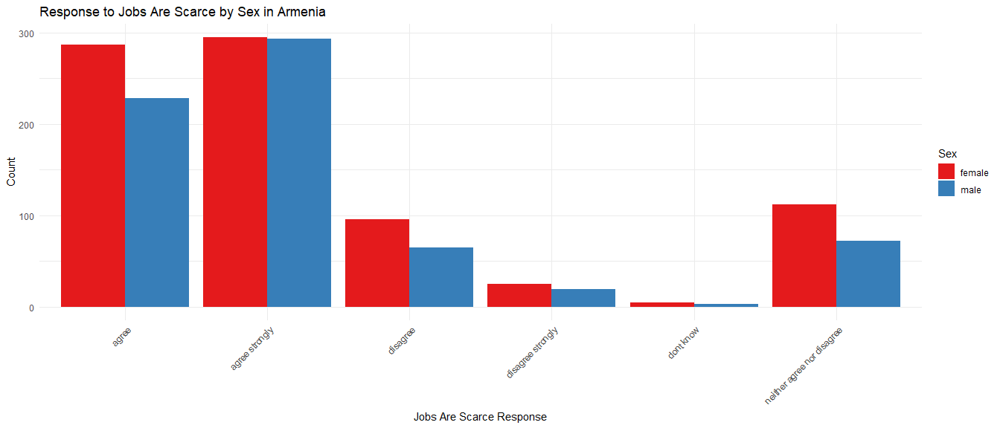
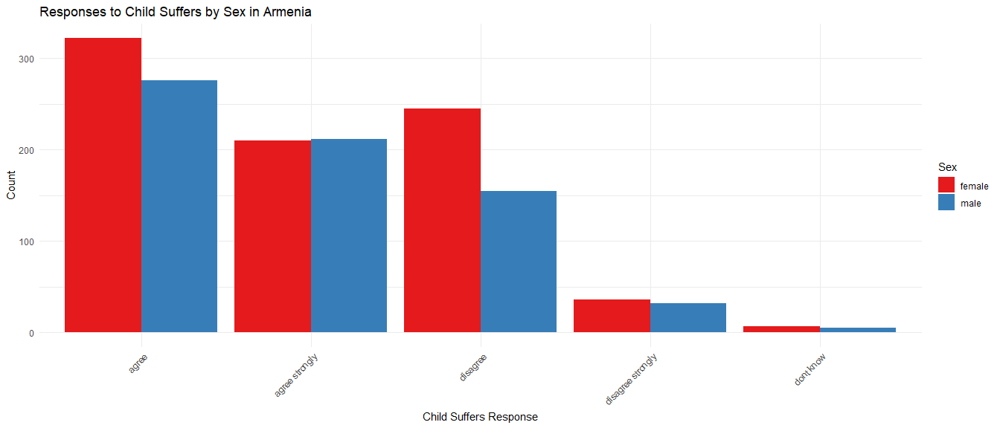

## General Information ##

  Within this report we have country-specific categorical descriptive statistics. We can observe each report is a stand-alone document (take note of the 100% percentage of the specified state, along with the frequency of reports, and then a break down by category comprising the entire frequency). 
  
  Our continuous variable, age, is also state-specific. Then we display bar charts on responses by sex regarding our two dependent variables; jobs_are_scarce and child_suffers. Last we show a regression model along with a dynamic report explaining the results. 

## Table 1 - Categorical Variable Descriptive Statistics ##
<table class="table" style="color: black; margin-left: auto; margin-right: auto;">
<caption>Descriptive Summary of Categorical Variables for Armenia</caption>
 <thead>
  <tr>
   <th style="text-align:left;"> Variable </th>
   <th style="text-align:left;"> Category </th>
   <th style="text-align:right;"> Frequency </th>
   <th style="text-align:right;"> Percentage </th>
  </tr>
 </thead>
<tbody>
  <tr>
   <td style="text-align:left;width: 4cm; "> country </td>
   <td style="text-align:left;width: 4cm; "> Armenia </td>
   <td style="text-align:right;"> 1500 </td>
   <td style="text-align:right;"> 100.0000000 </td>
  </tr>
  <tr>
   <td style="text-align:left;width: 4cm; "> education </td>
   <td style="text-align:left;width: 4cm; "> Bachelor or equivalent </td>
   <td style="text-align:right;"> 156 </td>
   <td style="text-align:right;"> 10.4000000 </td>
  </tr>
  <tr>
   <td style="text-align:left;width: 4cm; "> education </td>
   <td style="text-align:left;width: 4cm; "> Doctoral or equivalent </td>
   <td style="text-align:right;"> 6 </td>
   <td style="text-align:right;"> 0.4000000 </td>
  </tr>
  <tr>
   <td style="text-align:left;width: 4cm; "> education </td>
   <td style="text-align:left;width: 4cm; "> Less than primary </td>
   <td style="text-align:right;"> 29 </td>
   <td style="text-align:right;"> 1.9333333 </td>
  </tr>
  <tr>
   <td style="text-align:left;width: 4cm; "> education </td>
   <td style="text-align:left;width: 4cm; "> Lower secondary </td>
   <td style="text-align:right;"> 71 </td>
   <td style="text-align:right;"> 4.7333333 </td>
  </tr>
  <tr>
   <td style="text-align:left;width: 4cm; "> education </td>
   <td style="text-align:left;width: 4cm; "> Master or equivalent </td>
   <td style="text-align:right;"> 265 </td>
   <td style="text-align:right;"> 17.6666667 </td>
  </tr>
  <tr>
   <td style="text-align:left;width: 4cm; "> education </td>
   <td style="text-align:left;width: 4cm; "> Post-secondary non tertiary </td>
   <td style="text-align:right;"> 86 </td>
   <td style="text-align:right;"> 5.7333333 </td>
  </tr>
  <tr>
   <td style="text-align:left;width: 4cm; "> education </td>
   <td style="text-align:left;width: 4cm; "> Primary </td>
   <td style="text-align:right;"> 25 </td>
   <td style="text-align:right;"> 1.6666667 </td>
  </tr>
  <tr>
   <td style="text-align:left;width: 4cm; "> education </td>
   <td style="text-align:left;width: 4cm; "> Short-cycle tertiary </td>
   <td style="text-align:right;"> 137 </td>
   <td style="text-align:right;"> 9.1333333 </td>
  </tr>
  <tr>
   <td style="text-align:left;width: 4cm; "> education </td>
   <td style="text-align:left;width: 4cm; "> Upper secondary </td>
   <td style="text-align:right;"> 725 </td>
   <td style="text-align:right;"> 48.3333333 </td>
  </tr>
  <tr>
   <td style="text-align:left;width: 4cm; "> child_suffers </td>
   <td style="text-align:left;width: 4cm; "> agree </td>
   <td style="text-align:right;"> 598 </td>
   <td style="text-align:right;"> 39.8666667 </td>
  </tr>
  <tr>
   <td style="text-align:left;width: 4cm; "> child_suffers </td>
   <td style="text-align:left;width: 4cm; "> agree strongly </td>
   <td style="text-align:right;"> 422 </td>
   <td style="text-align:right;"> 28.1333333 </td>
  </tr>
  <tr>
   <td style="text-align:left;width: 4cm; "> child_suffers </td>
   <td style="text-align:left;width: 4cm; "> disagree </td>
   <td style="text-align:right;"> 400 </td>
   <td style="text-align:right;"> 26.6666667 </td>
  </tr>
  <tr>
   <td style="text-align:left;width: 4cm; "> child_suffers </td>
   <td style="text-align:left;width: 4cm; "> disagree strongly </td>
   <td style="text-align:right;"> 68 </td>
   <td style="text-align:right;"> 4.5333333 </td>
  </tr>
  <tr>
   <td style="text-align:left;width: 4cm; "> child_suffers </td>
   <td style="text-align:left;width: 4cm; "> dont know </td>
   <td style="text-align:right;"> 12 </td>
   <td style="text-align:right;"> 0.8000000 </td>
  </tr>
  <tr>
   <td style="text-align:left;width: 4cm; "> jobs_are_scarce </td>
   <td style="text-align:left;width: 4cm; "> agree </td>
   <td style="text-align:right;"> 515 </td>
   <td style="text-align:right;"> 34.3333333 </td>
  </tr>
  <tr>
   <td style="text-align:left;width: 4cm; "> jobs_are_scarce </td>
   <td style="text-align:left;width: 4cm; "> agree strongly </td>
   <td style="text-align:right;"> 588 </td>
   <td style="text-align:right;"> 39.2000000 </td>
  </tr>
  <tr>
   <td style="text-align:left;width: 4cm; "> jobs_are_scarce </td>
   <td style="text-align:left;width: 4cm; "> disagree </td>
   <td style="text-align:right;"> 161 </td>
   <td style="text-align:right;"> 10.7333333 </td>
  </tr>
  <tr>
   <td style="text-align:left;width: 4cm; "> jobs_are_scarce </td>
   <td style="text-align:left;width: 4cm; "> disagree strongly </td>
   <td style="text-align:right;"> 44 </td>
   <td style="text-align:right;"> 2.9333333 </td>
  </tr>
  <tr>
   <td style="text-align:left;width: 4cm; "> jobs_are_scarce </td>
   <td style="text-align:left;width: 4cm; "> dont know </td>
   <td style="text-align:right;"> 8 </td>
   <td style="text-align:right;"> 0.5333333 </td>
  </tr>
  <tr>
   <td style="text-align:left;width: 4cm; "> jobs_are_scarce </td>
   <td style="text-align:left;width: 4cm; "> neither agree nor disagree </td>
   <td style="text-align:right;"> 184 </td>
   <td style="text-align:right;"> 12.2666667 </td>
  </tr>
</tbody>
</table>
## Table 2 - Continuous Variable Descriptive Statistics ##

Table: Descriptive Statistics for Age in Armenia

|     Mean|       SD| Min| 25% Quantile| Median| 75% Quantile| Max|
|--------:|--------:|---:|------------:|------:|------------:|---:|
| 44.45133| 17.38282|  19|           29|     43|           57|  82|
# Sex Impact on Dependent Variables #

### Plot 1 Sex/Jobs are Scarce ###
<!-- -->

### Plot 2 Sex/Child Suffers ###

<!-- -->

## Regression Models ##

Regression analysis for child suffers numeric in Armenia reveals the following significant relationships (p < 0.05):

the intercept has a positive effect (estimate: 2.684 *** )
respondent_sex_recodemale has a negative effect (estimate: -0.074 *** ) 

Regression analysis for jobs are scarce numeric in Armenia reveals the following significant relationships (p < 0.05):

the intercept has a positive effect (estimate: 2.265 *** )
respondent_sex_recodemale has a positive effect (estimate: 0.033 ** )

<table style="text-align:center"><caption><strong>Regression Models for Armenia</strong></caption>
<tr><td colspan="3" style="border-bottom: 1px solid black"></td></tr><tr><td style="text-align:left"></td><td colspan="2"><em>Dependent variable:</em></td></tr>
<tr><td></td><td colspan="2" style="border-bottom: 1px solid black"></td></tr>
<tr><td style="text-align:left"></td><td>child_suffers_numeric</td><td>jobs_are_scarce_numeric</td></tr>
<tr><td style="text-align:left"></td><td>(1)</td><td>(2)</td></tr>
<tr><td colspan="3" style="border-bottom: 1px solid black"></td></tr><tr><td style="text-align:left">Intercept</td><td>-0.074***</td><td>0.033***</td></tr>
<tr><td style="text-align:left"></td><td>(0.008)</td><td>(0.011)</td></tr>
<tr><td style="text-align:left"></td><td></td><td></td></tr>
<tr><td style="text-align:left">Sex Female</td><td>0.162</td><td>0.005</td></tr>
<tr><td style="text-align:left"></td><td>(0.188)</td><td>(0.254)</td></tr>
<tr><td style="text-align:left"></td><td></td><td></td></tr>
<tr><td style="text-align:left">Constant</td><td>2.684***</td><td>2.265***</td></tr>
<tr><td style="text-align:left"></td><td>(0.005)</td><td>(0.007)</td></tr>
<tr><td style="text-align:left"></td><td></td><td></td></tr>
<tr><td colspan="3" style="border-bottom: 1px solid black"></td></tr><tr><td style="text-align:left">Observations</td><td>59,438</td><td>59,438</td></tr>
<tr><td style="text-align:left">R2</td><td>0.001</td><td>0.0002</td></tr>
<tr><td style="text-align:left">Adjusted R2</td><td>0.001</td><td>0.0001</td></tr>
<tr><td style="text-align:left">Residual Std. Error (df = 59435)</td><td>0.958</td><td>1.296</td></tr>
<tr><td style="text-align:left">F Statistic (df = 2; 59435)</td><td>44.635***</td><td>4.782***</td></tr>
<tr><td colspan="3" style="border-bottom: 1px solid black"></td></tr><tr><td style="text-align:left"><em>Note:</em></td><td colspan="2" style="text-align:right">*p<0.1; **p<0.05; ***p<0.01</td></tr>
</table>

