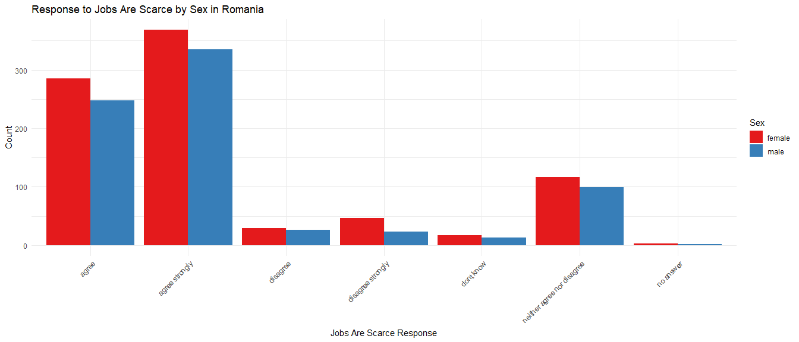
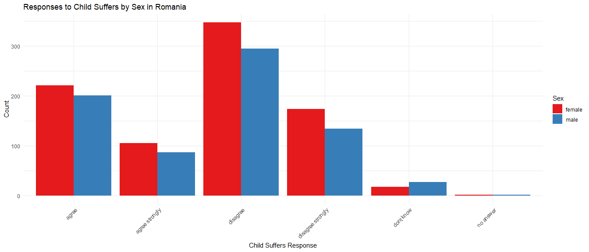

## General Information ##

  Within this report we have country-specific categorical descriptive statistics. We can observe each report is a stand-alone document (take note of the 100% percentage of the specified state, along with the frequency of reports, and then a break down by category comprising the entire frequency). 
  
  Our continuous variable, age, is also state-specific. Then we display bar charts on responses by sex regarding our two dependent variables; jobs_are_scarce and child_suffers. Last we show a regression model along with a dynamic report explaining the results. 

## Table 1 - Categorical Variable Descriptive Statistics ##
<table class="table" style="color: black; margin-left: auto; margin-right: auto;">
<caption>Descriptive Summary of Categorical Variables for Romania</caption>
 <thead>
  <tr>
   <th style="text-align:left;"> Variable </th>
   <th style="text-align:left;"> Category </th>
   <th style="text-align:right;"> Frequency </th>
   <th style="text-align:right;"> Percentage </th>
  </tr>
 </thead>
<tbody>
  <tr>
   <td style="text-align:left;width: 4cm; "> country </td>
   <td style="text-align:left;width: 4cm; "> Romania </td>
   <td style="text-align:right;"> 1613 </td>
   <td style="text-align:right;"> 100.0000000 </td>
  </tr>
  <tr>
   <td style="text-align:left;width: 4cm; "> education </td>
   <td style="text-align:left;width: 4cm; "> Bachelor or equivalent </td>
   <td style="text-align:right;"> 180 </td>
   <td style="text-align:right;"> 11.1593304 </td>
  </tr>
  <tr>
   <td style="text-align:left;width: 4cm; "> education </td>
   <td style="text-align:left;width: 4cm; "> Doctoral or equivalent </td>
   <td style="text-align:right;"> 1 </td>
   <td style="text-align:right;"> 0.0619963 </td>
  </tr>
  <tr>
   <td style="text-align:left;width: 4cm; "> education </td>
   <td style="text-align:left;width: 4cm; "> Less than primary </td>
   <td style="text-align:right;"> 22 </td>
   <td style="text-align:right;"> 1.3639182 </td>
  </tr>
  <tr>
   <td style="text-align:left;width: 4cm; "> education </td>
   <td style="text-align:left;width: 4cm; "> Lower secondary </td>
   <td style="text-align:right;"> 347 </td>
   <td style="text-align:right;"> 21.5127092 </td>
  </tr>
  <tr>
   <td style="text-align:left;width: 4cm; "> education </td>
   <td style="text-align:left;width: 4cm; "> Master or equivalent </td>
   <td style="text-align:right;"> 103 </td>
   <td style="text-align:right;"> 6.3856169 </td>
  </tr>
  <tr>
   <td style="text-align:left;width: 4cm; "> education </td>
   <td style="text-align:left;width: 4cm; "> Post-secondary non tertiary </td>
   <td style="text-align:right;"> 88 </td>
   <td style="text-align:right;"> 5.4556727 </td>
  </tr>
  <tr>
   <td style="text-align:left;width: 4cm; "> education </td>
   <td style="text-align:left;width: 4cm; "> Primary </td>
   <td style="text-align:right;"> 114 </td>
   <td style="text-align:right;"> 7.0675759 </td>
  </tr>
  <tr>
   <td style="text-align:left;width: 4cm; "> education </td>
   <td style="text-align:left;width: 4cm; "> Short-cycle tertiary </td>
   <td style="text-align:right;"> 9 </td>
   <td style="text-align:right;"> 0.5579665 </td>
  </tr>
  <tr>
   <td style="text-align:left;width: 4cm; "> education </td>
   <td style="text-align:left;width: 4cm; "> Upper secondary </td>
   <td style="text-align:right;"> 709 </td>
   <td style="text-align:right;"> 43.9553627 </td>
  </tr>
  <tr>
   <td style="text-align:left;width: 4cm; "> education </td>
   <td style="text-align:left;width: 4cm; "> dont know </td>
   <td style="text-align:right;"> 1 </td>
   <td style="text-align:right;"> 0.0619963 </td>
  </tr>
  <tr>
   <td style="text-align:left;width: 4cm; "> education </td>
   <td style="text-align:left;width: 4cm; "> no answer </td>
   <td style="text-align:right;"> 39 </td>
   <td style="text-align:right;"> 2.4178549 </td>
  </tr>
  <tr>
   <td style="text-align:left;width: 4cm; "> child_suffers </td>
   <td style="text-align:left;width: 4cm; "> agree </td>
   <td style="text-align:right;"> 422 </td>
   <td style="text-align:right;"> 26.1624303 </td>
  </tr>
  <tr>
   <td style="text-align:left;width: 4cm; "> child_suffers </td>
   <td style="text-align:left;width: 4cm; "> agree strongly </td>
   <td style="text-align:right;"> 192 </td>
   <td style="text-align:right;"> 11.9032858 </td>
  </tr>
  <tr>
   <td style="text-align:left;width: 4cm; "> child_suffers </td>
   <td style="text-align:left;width: 4cm; "> disagree </td>
   <td style="text-align:right;"> 642 </td>
   <td style="text-align:right;"> 39.8016119 </td>
  </tr>
  <tr>
   <td style="text-align:left;width: 4cm; "> child_suffers </td>
   <td style="text-align:left;width: 4cm; "> disagree strongly </td>
   <td style="text-align:right;"> 308 </td>
   <td style="text-align:right;"> 19.0948543 </td>
  </tr>
  <tr>
   <td style="text-align:left;width: 4cm; "> child_suffers </td>
   <td style="text-align:left;width: 4cm; "> dont know </td>
   <td style="text-align:right;"> 45 </td>
   <td style="text-align:right;"> 2.7898326 </td>
  </tr>
  <tr>
   <td style="text-align:left;width: 4cm; "> child_suffers </td>
   <td style="text-align:left;width: 4cm; "> no answer </td>
   <td style="text-align:right;"> 4 </td>
   <td style="text-align:right;"> 0.2479851 </td>
  </tr>
  <tr>
   <td style="text-align:left;width: 4cm; "> jobs_are_scarce </td>
   <td style="text-align:left;width: 4cm; "> agree </td>
   <td style="text-align:right;"> 533 </td>
   <td style="text-align:right;"> 33.0440174 </td>
  </tr>
  <tr>
   <td style="text-align:left;width: 4cm; "> jobs_are_scarce </td>
   <td style="text-align:left;width: 4cm; "> agree strongly </td>
   <td style="text-align:right;"> 704 </td>
   <td style="text-align:right;"> 43.6453813 </td>
  </tr>
  <tr>
   <td style="text-align:left;width: 4cm; "> jobs_are_scarce </td>
   <td style="text-align:left;width: 4cm; "> disagree </td>
   <td style="text-align:right;"> 55 </td>
   <td style="text-align:right;"> 3.4097954 </td>
  </tr>
  <tr>
   <td style="text-align:left;width: 4cm; "> jobs_are_scarce </td>
   <td style="text-align:left;width: 4cm; "> disagree strongly </td>
   <td style="text-align:right;"> 70 </td>
   <td style="text-align:right;"> 4.3397396 </td>
  </tr>
  <tr>
   <td style="text-align:left;width: 4cm; "> jobs_are_scarce </td>
   <td style="text-align:left;width: 4cm; "> dont know </td>
   <td style="text-align:right;"> 30 </td>
   <td style="text-align:right;"> 1.8598884 </td>
  </tr>
  <tr>
   <td style="text-align:left;width: 4cm; "> jobs_are_scarce </td>
   <td style="text-align:left;width: 4cm; "> neither agree nor disagree </td>
   <td style="text-align:right;"> 216 </td>
   <td style="text-align:right;"> 13.3911965 </td>
  </tr>
  <tr>
   <td style="text-align:left;width: 4cm; "> jobs_are_scarce </td>
   <td style="text-align:left;width: 4cm; "> no answer </td>
   <td style="text-align:right;"> 5 </td>
   <td style="text-align:right;"> 0.3099814 </td>
  </tr>
</tbody>
</table>
## Table 2 - Continuous Variable Descriptive Statistics ##

Table: Descriptive Statistics for Age in Romania

|     Mean|       SD| Min| 25% Quantile| Median| 75% Quantile| Max|
|--------:|--------:|---:|------------:|------:|------------:|---:|
| 50.35276| 18.38454|  18|           36|     50|           65|  82|
# Sex Impact on Dependent Variables #

### Plot 1 Sex/Jobs are Scarce ###
<!-- -->

### Plot 2 Sex/Child Suffers ###

<!-- -->

## Regression Models ##

Regression analysis for child suffers numeric in Romania reveals the following significant relationships (p < 0.05):

the intercept has a positive effect (estimate: 2.684 *** )
respondent_sex_recodemale has a negative effect (estimate: -0.074 *** ) 

Regression analysis for jobs are scarce numeric in Romania reveals the following significant relationships (p < 0.05):

the intercept has a positive effect (estimate: 2.265 *** )
respondent_sex_recodemale has a positive effect (estimate: 0.033 ** )

<table style="text-align:center"><caption><strong>Regression Models for Romania</strong></caption>
<tr><td colspan="3" style="border-bottom: 1px solid black"></td></tr><tr><td style="text-align:left"></td><td colspan="2"><em>Dependent variable:</em></td></tr>
<tr><td></td><td colspan="2" style="border-bottom: 1px solid black"></td></tr>
<tr><td style="text-align:left"></td><td>child_suffers_numeric</td><td>jobs_are_scarce_numeric</td></tr>
<tr><td style="text-align:left"></td><td>(1)</td><td>(2)</td></tr>
<tr><td colspan="3" style="border-bottom: 1px solid black"></td></tr><tr><td style="text-align:left">Intercept</td><td>-0.074***</td><td>0.033***</td></tr>
<tr><td style="text-align:left"></td><td>(0.008)</td><td>(0.011)</td></tr>
<tr><td style="text-align:left"></td><td></td><td></td></tr>
<tr><td style="text-align:left">Sex Female</td><td>0.162</td><td>0.005</td></tr>
<tr><td style="text-align:left"></td><td>(0.188)</td><td>(0.254)</td></tr>
<tr><td style="text-align:left"></td><td></td><td></td></tr>
<tr><td style="text-align:left">Constant</td><td>2.684***</td><td>2.265***</td></tr>
<tr><td style="text-align:left"></td><td>(0.005)</td><td>(0.007)</td></tr>
<tr><td style="text-align:left"></td><td></td><td></td></tr>
<tr><td colspan="3" style="border-bottom: 1px solid black"></td></tr><tr><td style="text-align:left">Observations</td><td>59,438</td><td>59,438</td></tr>
<tr><td style="text-align:left">R2</td><td>0.001</td><td>0.0002</td></tr>
<tr><td style="text-align:left">Adjusted R2</td><td>0.001</td><td>0.0001</td></tr>
<tr><td style="text-align:left">Residual Std. Error (df = 59435)</td><td>0.958</td><td>1.296</td></tr>
<tr><td style="text-align:left">F Statistic (df = 2; 59435)</td><td>44.635***</td><td>4.782***</td></tr>
<tr><td colspan="3" style="border-bottom: 1px solid black"></td></tr><tr><td style="text-align:left"><em>Note:</em></td><td colspan="2" style="text-align:right">*p<0.1; **p<0.05; ***p<0.01</td></tr>
</table>

